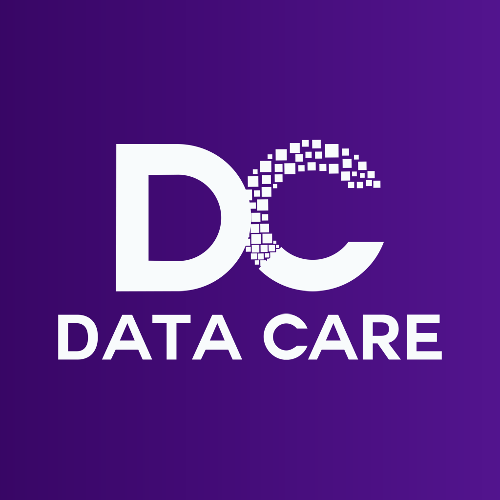

# 🏥 Data HealthCare App

<table>
  <tr>
    <td>
      Welcome to the <strong>Data HealthCare App</strong>, a mobile application designed to streamline patient registration and real-time data collection at healthcare camps. Built for <strong>DataCare LLC</strong>, this app ensures an efficient workflow for managing patient data and providing comprehensive healthcare services. The app utilizes cutting-edge technology to capture and process demographic, medical, and follow-up information on-site.
    </td>
    <td align="right">
      
    </td>
  </tr>
</table>

---

## 🚀 Project Overview

The **Data HealthCare App** is a mobile solution aimed at healthcare camps, enabling staff to quickly register patients, collect essential demographic information, track medical history, and store follow-up details. The app integrates directly with a secure backend to ensure smooth synchronization with centralized databases.

### Key Features:

* **Patient Registration**: Easily register new patients by capturing essential data such as name, date of birth, contact info, and relative details.
* **Medical History Recording**: Collect detailed medical records during patient visits, including symptoms, diagnoses, and treatment plans.
* **Follow-up Tracking**: Schedule and track follow-up appointments for patients.
* **Photo ID Upload**: Upload patient photos for easier identification, enhancing the registration process.
* **Real-time Data Sync**: All data collected during the camp is securely uploaded to the cloud for later analysis and reporting.

---

## 🛠️ Tech Stack and Architecture

### Frontend:

* **React Native** (with Expo): Provides a seamless experience for both Android and iOS users, with animations and a modern user interface aligned with DataCare LLC's branding.
* **Lottie Animations**: Adds dynamic animations for the registration flow, including success animations after patient registration.
* **FormData**: Used for capturing and uploading patient details and photo IDs to the backend.

### Backend:

* **Node.js with Express**: Handles all backend operations, including API endpoints for patient registration, medical history, and follow-ups.
* **Multer**: Used for managing image uploads (patient photos).
* **YugabyteDB**: A PostgreSQL-compatible database, hosted on **Google Cloud Platform (GCP)**, ensures robust data storage and scalability.

### Hosting and Deployment:

* **YugabyteDB on GCP**: Provides scalable and reliable cloud storage for patient data and medical history.

---

## 📑 Application Flow

1. **Registration**:

   * Staff members register patients by filling out demographic information (name, date of birth, gender, etc.).
   * Optionally, staff can upload an ID photo to facilitate patient identification.

2. **Medical History Collection**:

   * Medical details like symptoms, diagnoses, and treatments are entered.
   * The app uses forms with dynamic fields to accommodate different types of medical data.

3. **Follow-up Scheduling**:

   * The app enables scheduling follow-up appointments, which are then saved to the patient's record for future reference.

4. **Data Synchronization**:

   * All collected data is securely synchronized with the centralized database on GCP to allow for easy access and analysis.

---

## 🔑 Key Challenges and Solutions

* **Handling Real-time Data Sync**: We faced challenges in ensuring real-time data synchronization between the mobile app and the backend server, especially when dealing with large datasets in a healthcare setting. This was solved by optimizing the upload process and using asynchronous API calls for efficient data handling.

* **Photo Upload**: Implementing an efficient method to upload patient photos while ensuring that other data (e.g., forms) were submitted simultaneously required using **Multer** for image handling and **FormData** to submit everything as a unified request.

* **User Interface with DataCare Branding**: Creating a smooth user experience with custom animations and a professional UI layout was critical to meet DataCare LLC's branding requirements. We used **Lottie** animations to enhance the visual appeal and guide users through the registration process.

---

## 🏗️ Architecture

### Backend:

* **Express API**: Handles the logic for patient registration, medical history, and follow-up schedules.
* **YugabyteDB**: PostgreSQL-compatible database hosted on GCP, storing patient data and medical history.
* **Authentication**: JWT tokens are used for secure, role-based access control (admin, staff, and doctors).

### Frontend:

* **React Native**: Utilized to create cross-platform mobile apps, ensuring compatibility across both iOS and Android.
* **Expo**: Simplifies the development process with an easy setup, faster iteration, and deployment features.
* **Lottie for React Native**: Used to handle animations, making the app visually engaging.

---

## 📦 Installation

No setup instructions are provided, as this is a production-ready mobile app. The backend services and the app are already hosted and operational, with automatic syncing with the cloud.

---

## 🔧 Tech Stack

* **Frontend**: React Native (Expo), Lottie for animations
* **Backend**: Node.js, Express, Multer for image upload, JWT for authentication
* **Database**: YugabyteDB (on Google Cloud Platform)
* **Authentication**: JWT Tokens for secure, role-based access

---

## 💬 Contact

For further information or questions, feel free to reach out:

* **Email**: [ayushbhanot1010@gmail.com](mailto:ayushbhanot1010@gmail.com)
* **GitHub**: [ayushbhanot](https://github.com/ayushbhanot)

---

Let me know if you need any further adjustments or additional sections in the README!
